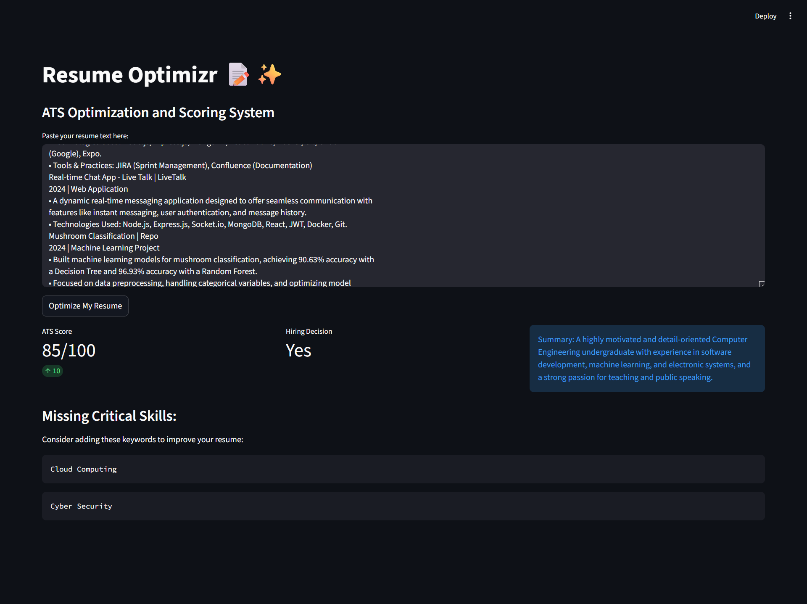
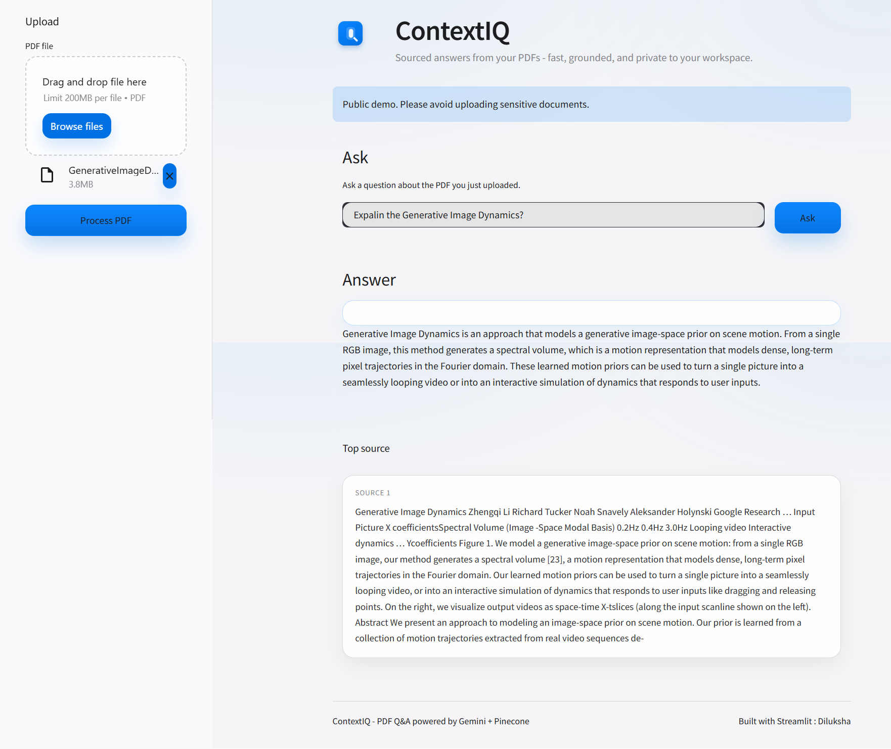
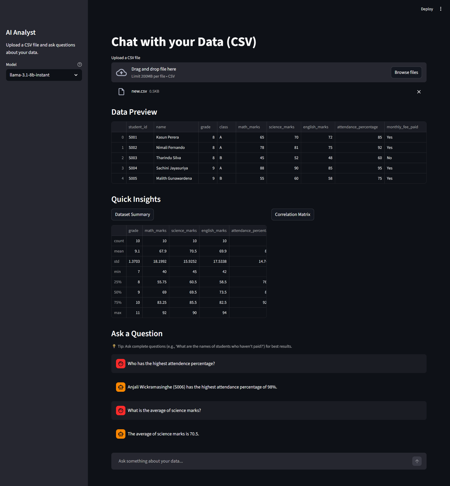

# AI Journal

Building projects using LangChain, Groq, Computer Vision, and Agents.

## Featured Projects

## Day 05 Resume Optimizer
A Streamlit dashboard that parses resumes into JSON and generates ATS scores using Llama 3.

- **Live Demo**: [https://ai-resume-diluksha.streamlit.app/](https://ai-resume-diluksha.streamlit.app/)
- **Tech Stack**: Python, Streamlit, LangChain, Groq API (Llama 3)
- **Key Concepts**: Structured Output (JSON), System Prompts

## Day 10 - Surveillance Video Analysis Dashboard

- **Tech Stack**: Python, OpenCV, LangChain, Groq API (Llama 3), Streamlit
- **Key Concepts**: Real-time video processing, AI-generated alerts, Text-to-Speech

## Day 20 ContexIQ - RAG Application
A Streamlit app that enables users to chat with PDF documents using Retrieval-Augmented Generation.

- **Live Demo**: [https://contextiq-rag.streamlit.app/](https://contextiq-rag.streamlit.app/)
- **Tech Stack**: Python, Streamlit, LangChain, Groq API (Llama 3), Pinecone
- **Key Concepts**: Vector Databases, RAG Agents, PDF Ingestion

## Day 25 AI Analyst Application
A Streamlit app that allows users to upload datasets and ask questions, with the AI agent performing data analysis and visualization.

- **GitHub Repo**: [https://github.com/Diluksha-Upeka/ai-analyst](https://github.com/Diluksha-Upeka/ai-analyst)
- **Tech Stack**: Python, Streamlit, LangChain, Groq API (Llama 3), Pandas, Matplotlib
- **Key Concepts**: Data Analysis, Visualization, Multi-tool Agents

## Structure
- `day01/` - first entry [View Code](./day01/main.py)
- `day02/` - AI system Prompts [View Code](./day02/system_prompts.py)
- `day03/` - Structured Outputs (JSON) [View Code](./day03/structured_output.py)
- `day04/` - Streamlit UI [View Code](./day04/app.py)
- `day05/` - AI Resume Dashboard [View Code](./day05/app.py)
- `day06/` - Deployed the App [Live app](https://ai-resume-diluksha.streamlit.app/)
- `day07/` - Worked on Documentation

- `day08/` - Google Gemini Vision API [View Code](./day08/vision.py)
- `day09/` - Real-time webcam feed analysis [View Code](./day09/cam_analyze.py)
- `day10/` - Continuous video feed analysis [View Code](./day10/security_loop.py)
- `day11/` - Dashboard UI for video analysis [View Code](./day10/dashboard.py)
- `day12/` - Added text-to-speech alerts [View Code](./day10/dashboard.py)
- `day13/` - Worked on Documentation [View Code](./README.md)

- `day14/` - Setting up Pinecone vector DB 
- `day15/` - Vector DB memory storage [View Code](./day15/store_memory.py) [View Doc](./day15/Vector_databases.md)
- `day16/` - Memory retrieval system [View Code](./day15/retrieve_memory.py) [View Doc](./day15/Memory_Retrival.md)
- `day17/` - RAG Agent implementation [View Code](./day15/rag_agent.py) [View Doc](./day15/rag.md)
- `day18/` - Ingestion pipeline for RAG [View Code](./day15/ingest_pdf.py)
- `day19/` - ContexIQ - Chat with pdfs using RAG app development
- `day20/` - Deployment of RAG Application [Live app](https://contextiq-rag.streamlit.app/)

- `day21/` - Agent with Internet Search capability [View Code](./day21/search_agent.py)
- `day22/` - Multi-tool Agent with reasoning [View Code](./day22/multi_agent.py)
- `day23/` - Coder Agent with Python REPL [View Code](./day23/coder_agent.py) [View Doc](./day23/README.md)
- `day24/` - Agent with multiple tools (search, code, calculator) 
- `day25/` - AI analyst application [View Code](./day25/analyst_app.py) [GitHub Repo](https://github.com/Diluksha-Upeka/ai-analyst)
- `day26/` - Added data visualization to analyst app 

## Tools Used
- **Models**: Groq API (Llama 3)
- **Frameworks**: LangChain, Streamlit

### Travily Search Agent
A LangChain agent that uses the Tavily Search tool to fetch real-time information from the web.

## Required Dependencies
- langchain
- langchain-experimental
- langchainhub
- streamlit
- groq
- google-generativeai
- python-dotenv
- pillow
- opencv-python
- pyttsx3
- pinecone
- google-genai
- pypdf
- numexpr

``Last updated 14th Feb 2026``

